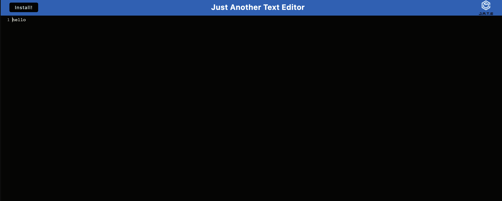

# Text-Editor

## Table of Contents
* [Descriptions](#description)
* [Installation](#installation)
* [Dependencies](#dependencies)
* [Usage](#usage)
* [Credits](#credits)
* [License](#license)
* [Questions](#questions)

## Description

The aim of my project was to develop a text editor that satisfies the requirements of a PWA. The text editor I created is a single-page application that can operate offline and is accessible via a web browser.

## Installation

## Dependencies

npm i

## Usage

To utilize the application through the command line (once dependencies are installed), follow these steps:

1. Navigate to the root directory of the repository in your terminal or bash.
2. Execute "npm run build" command in the command line to bundle the front-end code.
3. Execute "npm run start" command in the command line to start the server.
3. Access the port on your local host.
4. Click on the "Install" button.

## Credits

[Sara Schroeder](https://github.com/saraschroeder)

## License

[MIT](https://choosealicense.com/licenses/mit/)

## Questions

If you have any questions, please contact me at [sara.schroeder00@gmail.com](mailto:sara.schroeder00@gmail.com). 

Please find my GitHub here!
[saraschroeder](https://github/saraschroeder)